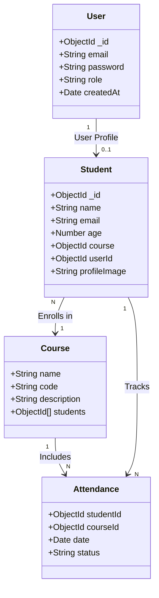

# Class Diagram

```mermaid
classDiagram
    class User {
        +ObjectId _id
        +String email
        +String password
        +String role
        +Date createdAt
    }

    class Student {
        +ObjectId _id
        +String name
        +String email
        +Number age
        +ObjectId course
        +ObjectId userId
        +String profileImage
    }

    class Course {
        +String name
        +String code
        +String description
        +ObjectId[] students
    }

    class Attendance {
        +ObjectId studentId
        +ObjectId courseId
        +Date date
        +String status
    }

    User "1" --> "0..1" Student : User Profile
    Student "N" --> "1" Course : Enrolls in
    Course "1" --> "N" Attendance : Includes
    Student "1" --> "N" Attendance : Tracks
```
