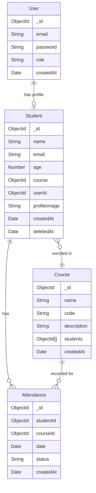

# Entity-Relationship Diagram

This diagram visualizes the database relationships in the Student Management System.

```mermaid
erDiagram
    User ||--o| Student : "has profile"
    Student }o--|| Course : "enrolled in"
    Student ||--o{ Attendance : "has"
    Course ||--o{ Attendance : "recorded for"

    User {
        ObjectId _id
        String email
        String password
        String role
        Date createdAt
    }

    Student {
        ObjectId _id
        String name
        String email
        Number age
        ObjectId course
        ObjectId userId
        String profileImage
        Date createdAt
        Date deletedAt
    }

    Course {
        ObjectId _id
        String name
        String code
        String description
        ObjectId[] students
        Date createdAt
    }

    Attendance {
        ObjectId _id
        ObjectId studentId
        ObjectId courseId
        Date date
        String status
        Date createdAt
    }
```
