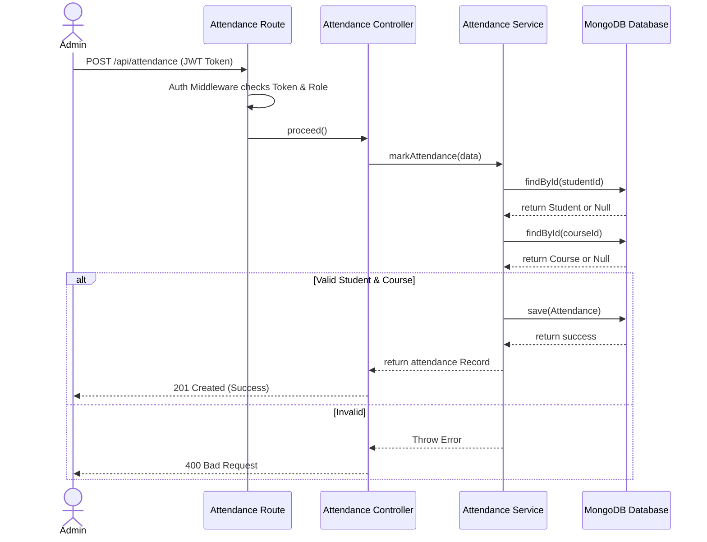

# Sequence Diagram: Mark Attendance

```mermaid
sequenceDiagram
    actor Admin
    participant Route as Attendance Route
    participant Control as Attendance Controller
    participant Service as Attendance Service
    participant DB as MongoDB Database

    Admin->>Route: POST /api/attendance (JWT Token)
    Route->>Route: Auth Middleware checks Token & Role
    Route->>Control: proceed()
    Control->>Service: markAttendance(data)
    Service->>DB: findById(studentId)
    DB-->>Service: return Student or Null
    Service->>DB: findById(courseId)
    DB-->>Service: return Course or Null
    alt Valid Student & Course
        Service->>DB: save(Attendance)
        DB-->>Service: return success
        Service-->>Control: return attendance Record
        Control-->>Admin: 201 Created (Success)
    else Invalid
        Service-->>Control: Throw Error
        Control-->>Admin: 400 Bad Request
    end
```
